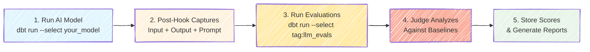

<p align="center">

</p>

<p align="center">
<a href="https://github.com/paradime-io/dbt-llm-evals/issues"></a>
<a href="#quick-start"></a>


<h2 align="center">
Warehouse-native LLM evaluation and monitoring for dbt™ projects
</h2>

<div align="center">

[Quick Start Guide »](docs/QUICKSTART.md) | [Package Overview »](docs/PACKAGE_OVERVIEW.md) | [Architecture Docs »](docs/ARCHITECTURE.md) | [Project Structure »](docs/STRUCTURE.md) | [Join the Discussion »](https://github.com/paradime-io/dbt-llm-evals/discussions)

</div>
<div align="center">
  ⭐️ Star the repo if this helps your LLM monitoring! 
</div>
</br>


A complete dbt™ package for evaluating LLM outputs directly within your data warehouse using warehouse-native AI functions. No external API calls, no data egress - everything runs inside your existing data infrastructure.

## What are LLM Evaluations?

LLM evaluations (or "evals") are systematic methods for measuring the quality, accuracy, and performance of Large Language Model outputs. When deploying AI models in production, you need to continuously monitor whether your model is producing high-quality results that meet your business requirements.

### Why Evaluate LLM Outputs?

- **Quality Assurance**: Ensure AI-generated content meets your standards
- **Performance Monitoring**: Track model performance over time
- **Drift Detection**: Identify when model outputs change unexpectedly
- **Business Confidence**: Provide measurable metrics for AI system reliability

### LLM-as-a-Judge Framework

This package uses the "LLM-as-a-Judge" approach, where another LLM evaluates the quality of your AI model's outputs. Instead of expensive human evaluation, a judge model:

1. **Receives** your original prompt, input data, and AI-generated output
2. **Compares** against baseline examples of good outputs
3. **Evaluates** across multiple criteria (accuracy, relevance, tone, etc.)
4. **Scores** each output on a 1-10 scale with detailed reasoning
5. **Provides** actionable feedback for improving your AI system

This approach is cost-effective, scalable, and runs entirely within your data warehouse using native AI functions.

## Overview

`dbt_llm_evals` allows teams to automatically evaluate AI/LLM-generated content in their dbt™ projects using a **judge-based evaluation framework** that runs entirely inside the data warehouse. No external API calls required!

### Key Features

- ✅ **Warehouse-Native**: Uses Snowflake Cortex, BigQuery Vertex AI, or Databricks AI Functions
- ✅ **Zero External Dependencies**: All evaluations run inside your warehouse
- ✅ **Automatic Capture**: Transparent post-hook integration with your AI models
- ✅ **Prompt Capture & Evaluation**: Captures prompts alongside inputs/outputs for comprehensive evaluation
- ✅ **Automatic Baseline Detection**: No manual toggling - baselines created automatically
- ✅ **Baseline Versioning**: Track multiple baseline versions (v1.0, v2.0, etc.)
- ✅ **Multiple Criteria**: Evaluate accuracy, relevance, tone, completeness, and more
- ✅ **Configurable**: Flexible sampling, thresholds, and judge models

## Supported Warehouses

| Warehouse | AI Service | Status |
|-----------|------------|--------|
| Snowflake | Cortex | ✅ Supported |
| BigQuery | Vertex AI | ✅ Supported |
| Databricks | AI Functions | ✅ Supported |

## How It Works



## Installation

Add to your `packages.yml`:

```yaml
packages:
  - package: paradime-io/dbt_llm_evals
    version: 1.0.0
```

Or install from git for development versions:

```yaml
packages:
  - git: "https://github.com/paradime-io/dbt-llm-evals.git"
    revision: main
```

Then run:

```bash
dbt deps
```

## Quick Start

### 1. Setup Storage Tables

Run the setup model once to create the necessary tables:

```bash
dbt run --select llm_evals__setup
```

By default, this installs into your target schema. To use a custom schema, set the `llm_evals_schema` variable in your `dbt_project.yml` first.

### 2. Configure Global Variables

Configure required variables in your `dbt_project.yml`:

```yaml
vars:
  # Judge model (warehouse-specific)
  llm_evals_judge_model: 'llama3-70b'  # Snowflake
  # llm_evals_judge_model: 'gemini-pro'  # BigQuery
  # llm_evals_judge_model: 'llama-2-70b-chat'  # Databricks
  
  # Evaluation criteria
  llm_evals_criteria: '["accuracy", "relevance", "tone", "completeness"]'
  
  # Optional: customize other settings
  llm_evals_sampling_rate: 0.1  # 10% of outputs
  llm_evals_pass_threshold: 7  # Score >= 7 is pass
```

### 3. Configure Your AI Model

Add the `llm_evals` meta configuration to any model that uses AI functions:

```yaml
# models/ai_examples/_customer_support_responses.yml
version: 2

models:
  - name: customer_support_responses
    config:
      materialized: table
      post_hook: "{{ dbt_llm_evals.capture_and_evaluate() }}"
      meta:
        llm_evals:
          enabled: true
          baseline_version: 'v1.0'  # Optional: specify version
          input_columns:
            - customer_question
            - customer_context
            - ticket_category
          output_column: 'ai_response'
          prompt: >-
            You are a helpful customer support agent. 
            Respond to this customer question professionally and helpfully.
            Customer Context: {customer_context}
            Category: {ticket_category}
            Question: {customer_question}
            Response:
          sampling_rate: 0.2  # Evaluate 20% of responses
```

### 3. Your AI Model

```sql
-- models/ai_examples/customer_support_responses.sql
{{ config(
    materialized='table'
) }}

WITH support_tickets AS (
    select
        ticket_id,
        customer_name,
        customer_question,
        ticket_category,
        customer_tier,
        
        concat(
            'Customer: ', customer_name,
            ', Tier: ', customer_tier
        ) as customer_context
        
    from {{ ref('support_tickets_seed') }}
    where status = 'pending_ai_response'
)

select
    ticket_id,
    customer_question,
    customer_context,
    ticket_category,
    
    -- Call warehouse AI function
    AI_COMPLETE(
        '{{ var("llm_evals_judge_model") }}',
        concat(
            'You are a helpful customer support agent. ',
            'Respond to this customer question professionally and helpfully.',
            'Customer Context: ', customer_context,
            'Category: ', ticket_category,
            'Question: ', customer_question,
            'Response:'
        )
    ) as ai_response,
    
    current_timestamp() as generated_at
    
from support_tickets
```

### 5. Run Your Model

```bash
dbt run --select customer_support_responses
```

The package will automatically:
- **Create baseline** (v1.0) on first run if none exists
- **Capture inputs, outputs, and prompts** from your AI model into raw storage tables

### 6. Run Evaluation Models

Process the captured data through the evaluation engine:

```bash
dbt run --select tag:llm_evals
```

This will:
- **Generate judge prompts** with full context (original prompt + inputs + outputs + baseline examples)
- **Evaluate using the warehouse's AI** (no external calls)
- **Store scores and reasoning** for monitoring

### 7. View Results

```sql
-- Check evaluation scores
select * from llm_evals.llm_evals__performance_summary
order by eval_date desc;

-- Find low-scoring outputs
select 
    c.input_data,
    c.output_data,
    e.criterion,
    e.score,
    e.reasoning
from llm_evals.llm_evals__captures c
join llm_evals.llm_evals__judge_evaluations e 
    on c.capture_id = e.capture_id
where e.score < 5
order by e.score asc;

-- Monitor drift
select * from llm_evals.llm_evals__drift_detection
where drift_status in ('WARNING', 'ALERT');
```

## Configuration

### Global Variables

Configure in your `dbt_project.yml`:

```yaml
vars:
  # Storage
  # llm_evals_schema: 'llm_evals'  # Optional: Default is target.schema
  # Judge model (warehouse-specific)
  llm_evals_judge_model: 'llama3-70b'  # Snowflake
  # llm_evals_judge_model: 'gemini-pro'  # BigQuery
  # llm_evals_judge_model: 'llama-2-70b-chat'  # Databricks
  
  # Evaluation criteria
  llm_evals_criteria: '["accuracy", "relevance", "tone", "completeness"]'
  
  # Sampling rate (0.0 - 1.0)
  llm_evals_sampling_rate: 0.1  # 10% of outputs
  
  # Score thresholds
  llm_evals_pass_threshold: 7  # Score >= 7 is pass
  llm_evals_warn_threshold: 5  # Score 5-6 is warning
  
  # Drift detection
  llm_evals_drift_stddev_threshold: 2
  llm_evals_drift_lookback_days: 7
```

### Model-Specific Configuration

Override at the model level:

```yaml
# models/critical/_critical_ai_model.yml
version: 2

models:
  - name: critical_ai_model
    config:
      materialized: table
      post_hook: "{{ dbt_llm_evals.capture_and_evaluate() }}"
      meta:
        llm_evals:
          enabled: true
          sampling_rate: 1.0  # Evaluate 100% for critical models
          input_columns:
            - user_input
            - context
          output_column: 'ai_response'
          prompt: >-
            You are a helpful assistant. Respond to the user's question based on the provided context.
            Context: {context}
            User Question: {user_input}
            Guidelines:
            - Be accurate and helpful
            - Use only information from the context
            - If unsure, say so clearly
            Response:
```

## Evaluation Criteria

Built-in criteria:

| Criterion | Description | Scale |
|-----------|-------------|-------|
| `accuracy` | Factual correctness | 1-10 |
| `relevance` | Addresses the input appropriately | 1-10 |
| `tone` | Maintains appropriate tone | 1-10 |
| `completeness` | Fully addresses all aspects | 1-10 |
| `consistency` | Consistent with baseline examples | 1-10 |

## Automatic Baseline Detection

The package automatically handles baselines without any manual toggling:

### First Run - Automatic Baseline Creation

When you first run your model with `llm_evals` enabled:

```yaml
+meta:
  llm_evals:
    enabled: true
    baseline_version: 'v1.0'  # Optional: defaults to 'v1.0'
    input_columns:
      - input_col
    output_column: 'output_col'
```

```bash
dbt run --select your_model
```

The package detects no baseline exists and automatically:
1. **Creates baseline** with 100 sample outputs (configurable)
2. **Captures current run data** for future comparison
3. **Logs**: `No baseline found for version 'v1.0'. Creating baseline with 100 samples...`

### Subsequent Runs - Automatic Evaluation

All future runs automatically:
1. **Skip baseline creation** (v1.0 already exists)
2. **Capture new outputs** based on sampling rate
3. **Evaluate against baseline** using judge criteria
4. **Log**: `✓ Captured X inputs and outputs for evaluation`

### Baseline Versioning

Create new baseline versions when your model changes significantly:

```yaml
+meta:
  llm_evals:
    enabled: true
    baseline_version: 'v2.0'  # New version
```

Or force refresh existing version:

```yaml
+meta:
  llm_evals:
    enabled: true
    force_rebaseline: true     # Force new baseline
    baseline_version: 'v2.0'   # Update version
```

The system automatically:
- **Deactivates** old baselines (`v1.0` becomes `is_active: false`)
- **Creates** new baseline (`v2.0` becomes `is_active: true`)
- **Maintains** full version history for auditing

## Warehouse-Specific Setup

### Snowflake (Cortex)

```yaml
vars:
  llm_evals_judge_model: 'llama3-70b'  # or 'mistral-large', 'mixtral-8x7b'
```

Available models: https://docs.snowflake.com/en/user-guide/snowflake-cortex/llm-functions

### BigQuery (Vertex AI)

```yaml
vars:
  gcp_project_id: 'my-project'
  gcp_location: 'us-central1'
  llm_evals_dataset: 'llm_models'
  llm_evals_judge_model: 'gemini-pro'
  ai_connection_id: 'projects/my-project/locations/us-central1/connections/my-vertex-connection'
  ai_endpoint: 'gemini-2.5-flash'
```

**BigQuery Setup Requirements:**
- Vertex AI models registered in BigQuery
- Remote connection to Vertex AI configured
- Uses `AI.GENERATE()` function for evaluations

Available models: https://docs.cloud.google.com/vertex-ai/generative-ai/docs/models

### Databricks (AI Functions)

```yaml
vars:
  llm_evals_judge_model: 'llama-2-70b-chat'
```

Available models: https://docs.databricks.com/en/large-language-models/ai-functions.html

## Models

### Core Models

- `llm_evals__setup`: One-time setup model that creates raw storage tables
- `llm_evals__captures`: Processed captures from raw_captures
- `llm_evals__baselines`: Processed baselines from raw_baselines  
- `llm_evals__registry`: Registry of models being evaluated

### Raw Storage Tables (Created by Setup)

- `raw_captures`: Raw captured inputs/outputs/prompts from AI models
- `raw_baselines`: Raw baseline samples for comparison

### Evaluation Models

- `llm_evals__judge_evaluations`: Raw judge evaluations
- `llm_evals__eval_scores`: Parsed evaluation scores

### Monitoring Models

- `llm_evals__performance_summary`: Daily performance metrics
- `llm_evals__drift_detection`: Drift alerts and warnings
- `llm_evals__alerts`: Models requiring attention

## Macros

### Public Macros

- `capture_and_evaluate()`: Post-hook for automatic evaluation
- `create_baseline()`: Create baseline snapshot
- `build_judge_prompt()`: Build evaluation prompts

### Adapter Macros

- `llm_evals__ai_complete()`: Call warehouse AI (dispatched)
- `llm_evals__parse_json_response()`: Parse judge responses (dispatched)

## Troubleshooting

### Evaluations Not Running

- Check `llm_evals.enabled: true` in meta config
- Verify post-hook is configured
- Check sampling rate isn't too low
- Run `dbt™ run --select llm_evals__setup` first

### Parse Errors

- Ensure judge model returns valid JSON
- Check `llm_evals__parse_json_response` for your warehouse
- Review judge responses in `llm_evals__judge_evaluations`

### Manage Costs

- Lower sampling rate: `sampling_rate: 0.01` (1%)
- Reduce batch size: `llm_evals_batch_size: 100`
- Use smaller judge models

## Development & Testing

### Python Testing Framework

The package includes comprehensive Python tests for validation:

```bash
# Install testing dependencies
poetry install

# Run validation tests
poetry run pytest

# Run dbt compilation checks
dbt compile --select tag:llm_evals
dbt parse
```

### Test Coverage

- **Project structure validation**: Ensures required files and macros exist
- **SQL compilation tests**: Validates all SQL compiles correctly  
- **Example project validation**: Checks example configurations are valid
- **dbt parsing tests**: Ensures project parses without errors

## Contributing

Contributions welcome! See [CONTRIBUTING.md](CONTRIBUTING.md) for detailed guidelines.

Before submitting:
1. Run the test suite: `poetry run pytest`
2. Ensure dbt models compile: `dbt compile --select tag:llm_evals`
3. Update documentation as needed

## License

Apache 2.0 License - see LICENSE file

## Support

- GitHub Issues: [Report bugs or request features](https://github.com/paradime-io/dbt-llm-evals/issues)
- Documentation: See the complete docs in this repository
- Architecture: [ARCHITECTURE.md](ARCHITECTURE.md) for system diagrams

## Credits

Built with 💜 for the dbt™ community. 

**Contributing to the future of reliable AI in data workflows.**

---

*dbt® and dbt Core® are federally registered trademarks of dbt Labs, Inc. in the United States and various jurisdictions around the world. Paradime is not a partner of dbt Labs. All rights therein are reserved to dbt Labs. Paradime is not a product or service of or endorsed by dbt Labs, Inc.
