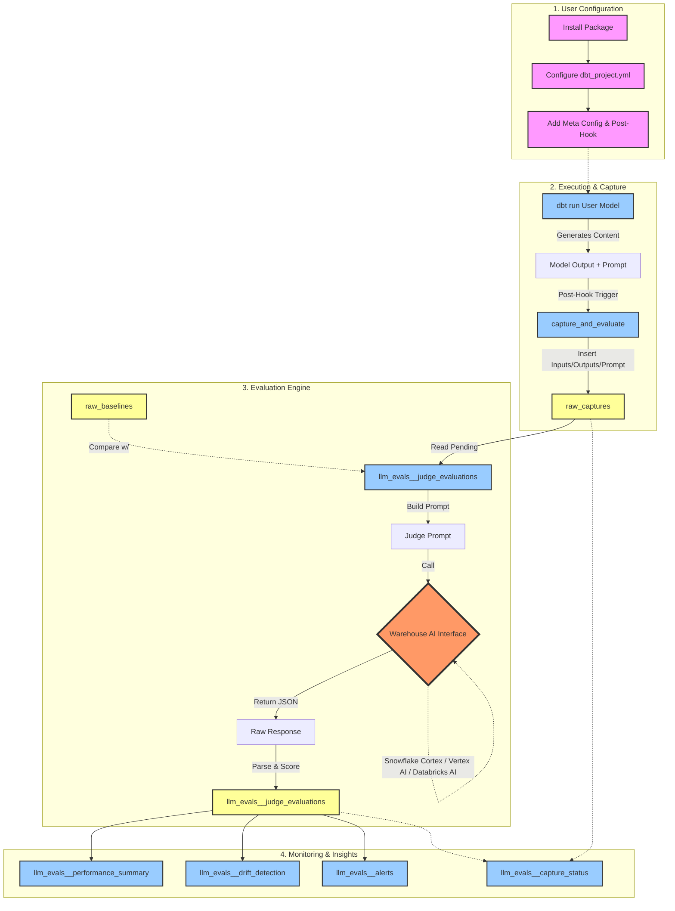

# Architecture & Workflow

This document visualizes how `dbt_llm_evals` integrates with your dbt project and processes evaluations.



## Workflow Description

1.  **User Configuration**: The user sets up the package and adds the necessary metadata and post-hooks to their dbt models.
2.  **Execution & Capture**: When the user's model runs, the post-hook automatically captures the input data, generated output, and prompt template (as configured in YAML meta), storing it in the `raw_captures` table.
3.  **Evaluation Engine**: The `llm_evals__judge_evaluations` model picks up any pending captures. It constructs a comprehensive judge prompt including the original prompt template, inputs, outputs, and baseline examples for comparison. This context-rich evaluation prompt is sent to the warehouse-native AI function and the returned JSON score and reasoning are parsed.
4.  **Monitoring & Insights**: Downstream models aggregate these scores to provide daily performance summaries, drift detection alerts, and overall status tracking.

## Prompt Capture Flow

The package captures prompts through the YAML meta configuration:

```yaml
# models/ai_examples/_your_model.yml
version: 2

models:
  - name: your_model
    config:
      post_hook: "{{ dbt_llm_evals.capture_and_evaluate() }}"
      meta:
        llm_evals:
          enabled: true
          input_columns:
            - customer_question
            - context
          output_column: 'ai_response' 
          prompt: >-
            You are a helpful assistant. Answer the customer's question based on context.
            Context: {context}
            Question: {customer_question}
            Answer:
```

**Capture Process:**
1. The `capture_and_evaluate()` post-hook reads the prompt template from meta configuration
2. Input data is extracted from the specified `input_columns`
3. Output data is extracted from the specified `output_column`
4. All three components (prompt template, inputs, outputs) are stored in `raw_captures`

**Judge Evaluation Context:**
When evaluating, the judge receives full context:
```
=== ORIGINAL PROMPT ===
[The prompt template from YAML config]

=== INPUT ===
[The actual input data]

=== OUTPUT ===
[The AI-generated output]

=== BASELINE EXAMPLES (for reference) ===
[Previous baseline examples from raw_baselines for consistency]
```

This comprehensive context allows the judge to evaluate not just the output quality, but how well the AI followed the original prompt instructions.
